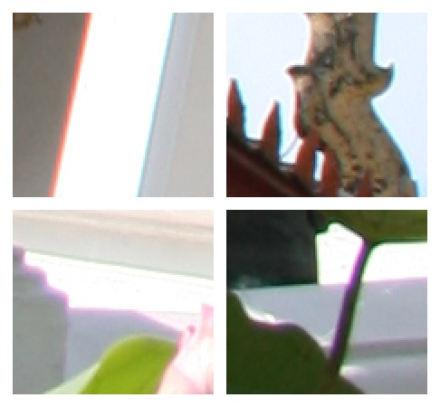
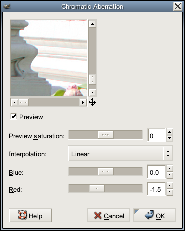
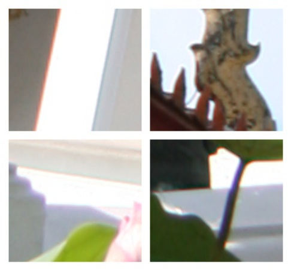
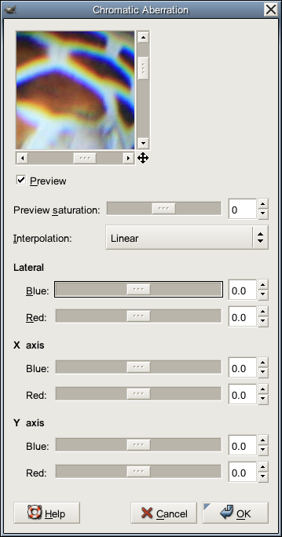
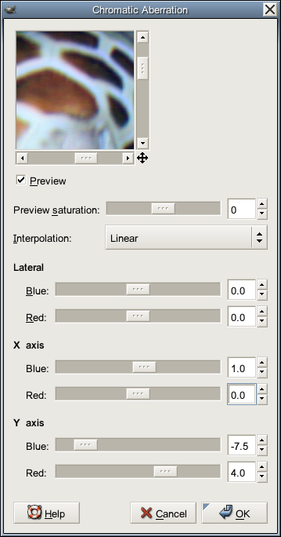

# Fix-CA

## Overview

Fix-CA is a [GIMP](http://www.gimp.org/) plug-in to correct chromatic
aberration (CA). For a general explanation about chromatic aberration,
you can find information from
[Wikipedia](http://en.wikipedia.org/wiki/Chromatic_aberration).
Fix-CA is able to fix lateral CA caused by lens and colored fringing
caused by light travel through dense material such as glass and water
(which is called directional CA in the program).

Current version of Fix-CA is 3.0.2.
This plug-in was written by Kriang Lerdsuwanakij lerdsuwa@users.sourceforge.net
and is distributed under [GNU General Public License Version 2](COPYING) (GPLv2).

## Download and building Fix-CA

Fix-CA can be downloaded from here.

Just get the C source file.
To compile and install the plug-in, you need the development library 
for Gimp.  Usually it's in gimp-devel package in your distribution.
Use the command
```sh
        gimptool-2.0 --install fix-ca.c
```
will automatically compile and install into the plug-in directory
of your account.  If you wish to make the plug-in available to all
users of the machine, use
```sh
        gimptool-2.0 --install-admin fix-ca.c
```
instead.  Type
```sh
        gimptool-2.0 --help
```
for further help.

If Gimp is already running in your system, exit and restart Gimp for the new
plug-in to be detected. The following displays Fix-CA version 2.1.0 information
from the GIMP menu.


## Using Fix-CA

Fix-CA plug-in can be accessed via the menu 'Filters->Colors->Chromatic Aberration'
There are two different modes of chromatic aberration that can be corrected by Fix-CA: 
lateral and directional.


### Lateral CA

Lateral chromatic aberration appears due to lens imperfection.
For this type of CA, the center of the image has no CA and the CA
gradually increase toward the border.  So the original image, rather than a
cropped version, should be used to eliminate the CA.

Below left is the image used to demonstrate Fix-CA plug-in capability
[full sized original here](img-fix-ca/full-Wat_Pathum_Wanaram.jpg) available under the
[GNU Free Documentation License Version 1.2 (GFDL) license](http://www.gnu.org/licenses/fdl.html).
This is a photo of Wat Pathum Wanaram, a buddhist temple next to Siam Paragon,
a major shopping mall in Bangkok. The areas of interest are marked with green
rectangles. Note that the reduced size here is only for display purpose.
The actual processing is done on the full sized image (with green rectangles
on a different layer, unaffected by the plug-in).

Below right is 200% zoom of the areas. The chromatic aberration (CA) is
visible on the right images as red and blue lines around bright area.
 

Normally it is not noticable in the final image. But can be quite visible
when the image is cropped to smaller area and then used (poor man's zoom).

Invoking Fix-CA plug-in via the menu 'Filters->Colors->Chromatic Aberration'
With the settings shown below in the left image (for version 2.1.0), much
of CA can be eliminated. For version 3.0.0 blue and red settings depicted are
moved under the group 'Lateral'. Below right is the 200% zoom for the
resulting change.
 

In the dialog box, setting red to -1.5 will shift the red channel inward to
the maximum of 1.5 pixels. Here the positive number means moving outward,
while the negative number means inward. Since the orientation of this photo
is portrait, the red channel of top and bottom border will movedby 1.5 pixels.
Pixels at the inner part the red channel will be moved less while the pixels
at the center of image will not be moved at all. (For landscape image, the
left and right border will be moved by 1.5 pixels instead).
The interpolation parameter controls how the plug-in deals with fractional
pixels, for example, if the plug-in decides to move an image pixel by 0.8
pixel, 'Linear' and 'Cubic' settings will try to get a value by averaging
the surrounding pixels while 'None' will pick the nearest pixel (for this
example by moving 1 full pixel).

The setting 'Preview saturation' changes the saturation for the preview image.
This may help spot CA problems. The setting does not have any effect on the
final image produced by this filter.

In this example we need to trade off between bottom right area (which suffers
from less CA) and the left area (the most CA).
When image is used cropped, you can concentrate on fixing in the part of image
that is actually used and ignore the rest.  A better result can be expected.
Just remember to correct CA before cropping.


### Directional CA

In directional chromatic aberration, the amount of CA is assumed to be the
same throughout the image.  This can happen, for example, when photographing
fishes in an aquarium.  Light travels through dense water and glass and bends
differently depending on the color.  This CA correction mode is introduced in
Fix-CA version 3.0.0. You can specify the amount of shift for blue and red
along both X and Y axis.

An example is the following photo of a sleeping sea turtle. The left side is
the complete photo. The right is the turtle head, zoom to 50%.
CA is severe and noticeable at this zoom level.
 

The amount of CA is roughly the same throughout the image. Starting from
the original, as in the left image below. By adjusting X-axis CA amount
and Y-axis amount to shift color component around, the result is quite
good with the settings on the right.
 

The picture below shows (50% zoom) corrected image of the interested region.


## Version History

- 3.0.2 (December 22, 2007) Add the missing tile cache that speed up preview.
- 3.0.1 (July 5, 2007) Fix a bug involving image row cache that cause bad CA correction when the number of pixel moved is large.
- 3.0.0 (July 3, 2007) Add CA fix in X and Y axis.
- 2.1.0 (January 24, 2007) Add saturation in preview. (Suggested by Reiner.)
- 2.0.0 (December 5, 2006) Improve speed. Add linear and cubic interpolation.
- 1.0.0 (November 30, 2006) First version.


## Future Plan

A long target is for the plug-in to work automatically without
requiring user to carefully choose the amount of shift.

Original Web page content and pictures are copyrighted (c) 2006, 2007 by Kriang Lerdsuwanakij.
